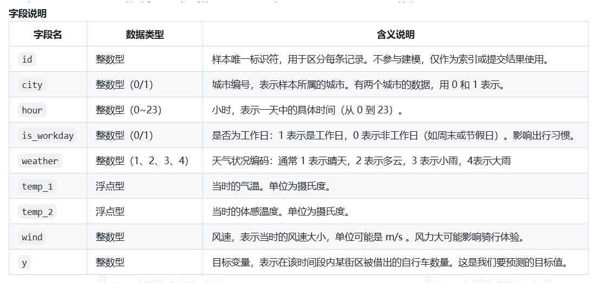

# 公共自行车使用量预测

公共自行车因其低碳、环保和健康的特性，在解决城市交通“最后一公里”问题方面表现出色，近年来在全国各大城市中得到了广泛应用。本题基于某两个城市部分街道上的公共自行车停放点的真实数据，旨在通过机器学习方法，根据时间、天气等相关因素，预测某街区在一小时内被借出的公共自行车数量。

训练集文件 train.csv中包含多个特征变量以及对应的自行车借出数量(目标变量)，测试集文件test.csv
提供了与训练集相同的特征信息，但不包含目标变量。本题需要基于训练数据建立算法模型，并利用该模型对测试集中的样本进行预测。

# 具体任务如下

* 使用train.csv文件中的数据完成数据预处理、特征工程及模型训练;
* 对训练模型进行性能评估与调优; 
* 利用训练好的模型对 test.csv中的数据进行预测，输出预测结果。
>>>>>>> 69bde95 (Initial commit)
